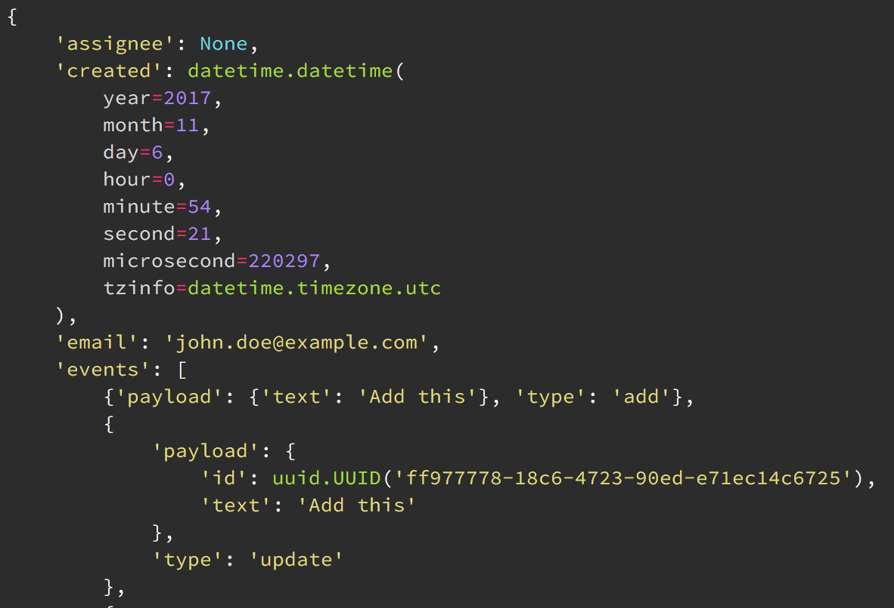
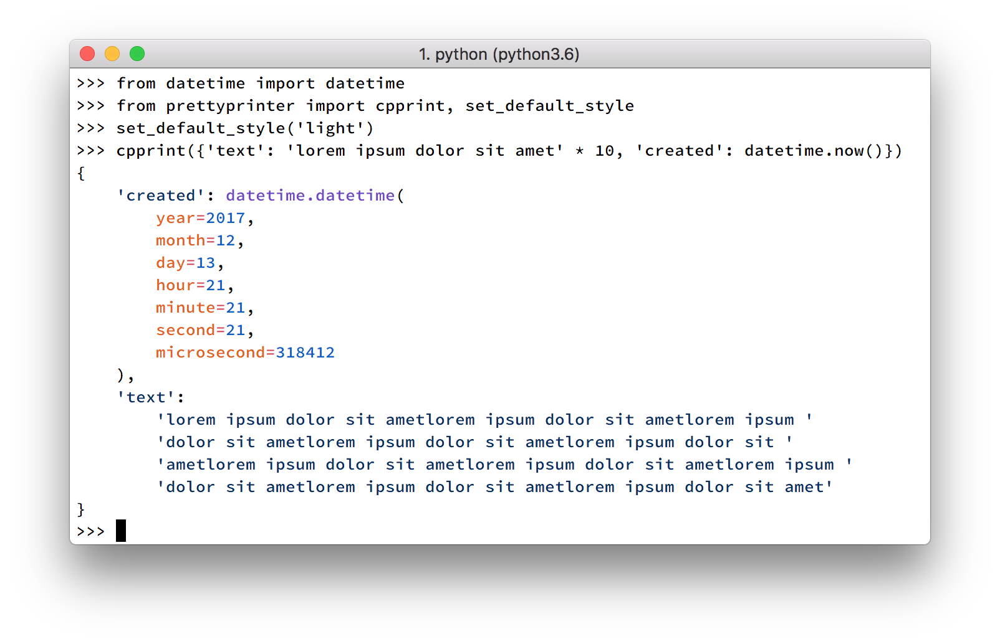

=============
PrettyPrinter
=============

Documentation_

Syntax-highlighting, declarative and composable pretty printer for Python 3.5+

.. code:: bash

    pip install prettyprinter

- Drop in replacement for the standard library ``pprint``: just rename ``pprint`` to ``prettyprinter`` in your imports.
- Uses a modified Wadler-Leijen layout algorithm for optimal formatting
- Write pretty printers for your own types with a dead simple, declarative interface

.. image:: ../prettyprinterscreenshot.png
    :alt:

.. image:: ../prettyprinterlightscreenshot.png
    :alt:

Pretty print common Python values:

.. code:: python

    >>> from datetime import datetime
    >>> from prettyprinter import pprint
    >>> pprint({'beautiful output': datetime.now()})
    {
        'beautiful output': datetime.datetime(
            year=2017,
            month=12,
            day=12,
            hour=0,
            minute=43,
            second=4,
            microsecond=752094
        )
    }

As well as your own, without any manual string formatting:

.. code:: python

    >>> class MyClass:
    ...     def __init__(self, one, two):
    ...         self.one = one
    ...         self.two = two

    >>> from prettyprinter import register_pretty, pretty_call

    >>> @register_pretty(MyClass)
    ... def pretty_myclass(value, ctx):
    ...     return pretty_call(ctx, MyClass, one=value.one, two=value.two)

    >>> pprint(MyClass((1, 2, 3), {'a': 1, 'b': 2}))
    MyClass(one=(1, 2, 3), two={'a': 1, 'b': 2})

    >>> pprint({'beautiful output': datetime.now(), 'beautiful MyClass instance': MyClass((1, 2, 3), {'a': 1, 'b': 2})})
    {
        'beautiful MyClass instance': MyClass(
            one=(1, 2, 3),
            two={'a': 1, 'b': 2}
        ),
        'beautiful output': datetime.datetime(
            year=2017,
            month=12,
            day=12,
            hour=0,
            minute=44,
            second=18,
            microsecond=384219
        )
    }

Comes packaged with the following pretty printer definitions, which you can enable by calling ``prettyprinter.install_extras()``:

- ``datetime`` - (installed by default)
- ``enum`` - (installed by default)
- ``pytz`` - (installed by default)
- ``dataclasses`` - any new class you create will be pretty printed automatically
- ``attrs`` - pretty prints any new class you create with ``attrs``
- ``django`` - pretty prints your Models and QuerySets
- ``numpy`` - pretty prints numpy scalars with explicit types
- ``requests`` - pretty prints Requests, Responses, Sessions, and more from the ``requests`` library

* Free software: MIT license
* Documentation: Documentation_.

.. _Documentation: https://prettyprinter.readthedocs.io
